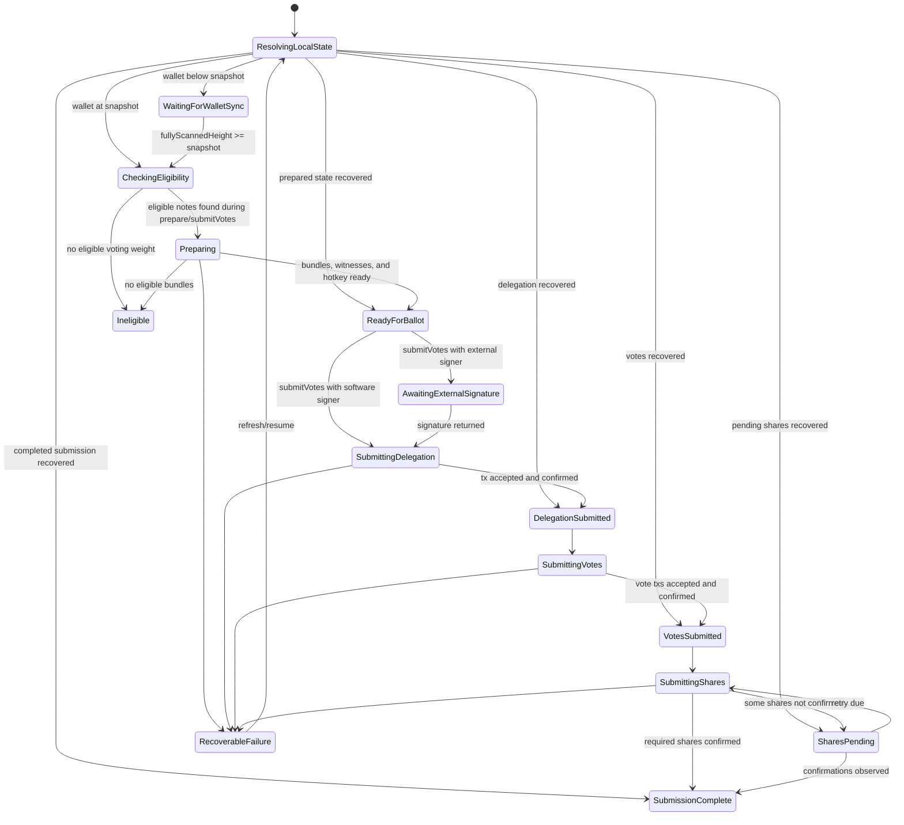

# Shielded Voting Public API Design

Status: draft

This document proposes the Android SDK public API shape for shielded voting.
It applies the principles in `public-api-design-principles.md` to a
concrete API surface, state machine, transport boundary, and migration plan.

The main design choice is that the public API is a voting workflow capability,
not a public wrapper around `VotingRustBackend` or `TypesafeVotingBackend`.
Zodl currently owns much of the workflow in app code. This design moves that
business logic below the app boundary so a third-party wallet can integrate by
rendering SDK state, asking for user authorization, and providing transport or
hardware-signing ports.

## Goals

- Expose shielded voting from the SDK public surface.
- Make the API account-scoped and synchronizer-scoped.
- Hide JNI, voting DB handles, wallet DB paths, raw note internals, and backend
  sequencing.
- Represent the voting state machine in public SDK types.
- Keep network transport replaceable without moving workflow logic into apps.
- Treat hardware signing as a first-class workflow path.
- Keep the first API experimental while the protocol and Rust layer continue to
  evolve.
- Treat `zcash_voting` as the intended source of truth for reusable voting
  workflow, recovery, retry, timing, and planning rules as those APIs become
  available.
- Update Zodl to use only the public SDK API.

## Non-Goals

- Do not redesign Zodl UI.
- Do not expose every internal voting DB method verbatim.
- Do not make the Android SDK the permanent source of truth for protocol
  constants or workflow invariants that belong in `zcash_voting`.
- Do not make shielded voting imply ownership of the whole Zcash governance
  protocol. Public names should say "voting" or "shielded voting", not generic
  "governance", except where mirroring an existing upstream term internally.

## Rust Ownership During The Refactor

The Android public API should be designed for the target architecture, not only
for the current transitional implementation.

The Android SDK may temporarily orchestrate pieces that are still becoming common
Rust APIs, but the public API should assume that protocol workflow rules
continue to move into `zcash_voting`.

Rules:

- Prefer Rust-owned implementations for workflow transitions, recovery planning,
  helper-share retry timing, PIR snapshot selection, note-bundle planning,
  configuration switch planning, and protocol validation.
- If Kotlin temporarily owns or mirrors one of those rules, document the
  upstream Rust target, keep the logic behind the public SDK workflow boundary,
  and add parity tests or fixture tests that catch drift.
- Do not expose transitional Kotlin orchestration as public API. Apps should see
  stable workflow capabilities and typed state, regardless of whether the first
  implementation is Rust-owned, Kotlin-owned, or split across both.
- Direct Rust consumers, Android SDK consumers, and future SDKs should converge
  on the same high-level behavior. Divergence is acceptable only when it is
  documented as a temporary migration step.

## Package Layout

Public API:

```text
cash.z.ecc.android.sdk.voting
cash.z.ecc.android.sdk.model.voting
```

Internal adapters:

```text
cash.z.ecc.android.sdk.internal.voting
cash.z.ecc.android.sdk.internal.model.voting
```

Rules:

- `cash.z.ecc.android.sdk.voting` contains capabilities, workflow interfaces,
  transport ports, and signer/secret-store ports.
- `cash.z.ecc.android.sdk.model.voting` contains public domain models.
- `cash.z.ecc.android.sdk.internal.*` contains JNI carriers, backend adapters,
  note mapping, wallet DB access, Rust error mapping, and persistence wiring.

## Stability Annotation

The first public API should be opt-in:

```kotlin
@RequiresOptIn(
    message = "The shielded voting API is experimental and may change.",
    level = RequiresOptIn.Level.ERROR
)
annotation class ExperimentalVotingApi
```

All public voting types, methods, and extension points should be annotated with
`@ExperimentalVotingApi`.

## Public Entry Point

`Synchronizer` gets a voting capability, following the existing `broadcaster`
capability pattern:

```kotlin
interface Synchronizer {
    /**
     * Shielded voting capability scoped to this synchronizer's wallet data and
     * network.
     */
    @ExperimentalVotingApi
    val voting: Voting
        get() = UnavailableVoting
}
```

The SDK-backed synchronizer provides a real implementation. Test or unavailable
synchronizers can keep the default object that throws `VotingException.Unavailable`.

## Capability Shape

The top-level capability is synchronizer-scoped. Account-specific work binds an
`AccountUuid` and returns an account-scoped workflow surface.

```kotlin
@ExperimentalVotingApi
interface Voting {
    /**
     * Returns a voting workflow capability for an account tracked by this
     * synchronizer.
     */
    fun forAccount(accountUuid: AccountUuid): AccountVoting

    /**
     * Resolves and authenticates the current voting configuration. The SDK owns
     * parsing, hash validation, signature validation, supported-version checks,
     * and round authentication. The transport only fetches untrusted payloads.
     */
    suspend fun resolveConfiguration(
        request: ResolveVotingConfigurationRequest,
        transport: VotingConfigTransport
    ): VotingConfigurationPlan

    /**
     * Applies a previously resolved configuration plan and performs SDK-owned
     * local state reconciliation before making the configuration current.
     */
    suspend fun applyConfigurationPlan(
        plan: VotingConfigurationPlan
    ): VotingConfiguration

    /**
     * Warms proving resources used by voting. Safe to call at app startup.
     */
    suspend fun warmProvingCaches()
}

@ExperimentalVotingApi
interface AccountVoting : Closeable {
    /**
     * Opens or creates local SDK voting state for an authenticated round.
     */
    fun round(round: AuthenticatedVotingRound): VotingRoundWorkflow

    /**
     * Lists rounds with local SDK voting state for this account.
     */
    suspend fun listLocalRounds(): List<VotingRoundSummary>

    /**
     * Clears all local voting state for a round.
     */
    suspend fun clearRound(roundId: VotingRoundId)
}
```

Important properties:

- The app does not open a voting DB.
- The app does not know the voting DB path.
- The app does not pass a raw wallet ID string.
- The app does not pass a raw DB handle.
- The app does not build `VotingNoteInfo`.

## Workflow Surface

`VotingRoundWorkflow` is the primary product API. It owns preparation,
submission, recovery, share tracking, and hardware-signing transitions for one
account in one authenticated round.

```kotlin
@ExperimentalVotingApi
interface VotingRoundWorkflow {
    /**
     * Current durable SDK view of this account's voting workflow for the round.
     */
    val state: StateFlow<VotingWorkflowSnapshot>

    /**
     * Refreshes derived state without performing irreversible actions. This can
     * check wallet sync, local round state, recovery state, and remote share or
     * transaction status through the supplied transport.
     */
    suspend fun refresh(
        request: RefreshVotingRoundRequest,
        transport: VotingTransport
    ): VotingWorkflowSnapshot

    /**
     * Prepares the account for the round without submitting votes. This is an
     * optional preflight/warm-up operation. `submitVotes` also performs this
     * reconciliation when required, so callers are not required to call
     * `prepare` first.
     */
    fun prepare(
        request: PrepareVotingRoundRequest,
        transport: VotingTransport
    ): Flow<VotingWorkflowEvent>

    /**
     * Submits votes for one or more proposals. The SDK first refreshes local
     * state, prepares missing bundles/hotkey state when needed, and resumes any
     * already-started submission. It then owns delegation submission, vote
     * commitment construction, transaction submission, confirmation probing,
     * share payload creation, share submission, retry timing, and recovery
     * persistence.
     */
    fun submitVotes(
        request: SubmitVotesRequest,
        transport: VotingTransport
    ): Flow<VotingWorkflowEvent>

    /**
     * Resumes interrupted work using SDK recovery state.
     */
    fun resume(
        request: ResumeVotingRequest,
        transport: VotingTransport
    ): Flow<VotingWorkflowEvent>

    /**
     * Checks pending helper share submissions and performs SDK-owned retries
     * when policy says they are due.
     */
    fun trackShares(
        request: TrackVotingSharesRequest,
        transport: VotingTransport
    ): Flow<VotingWorkflowEvent>
}
```

This API intentionally does not expose operations named like
`storeWitnesses`, `storeVanPosition`, `markVoteSubmitted`, or
`recordShareDelegation`. Those are implementation and recovery details of the
workflow.

## App Integration Model

The app owns UI, consent, hardware interaction, and transport wiring. The SDK
owns voting decisions.

Example:

```kotlin
@OptIn(ExperimentalVotingApi::class)
suspend fun submitFromWallet(
    synchronizer: Synchronizer,
    accountUuid: AccountUuid,
    configTransport: VotingConfigTransport,
    votingTransport: VotingTransport,
    signer: VotingSigner,
    choices: VotingBallot
) {
    val configurationPlan =
        synchronizer.voting.resolveConfiguration(
            request = ResolveVotingConfigurationRequest.Bundled,
            transport = configTransport
        )
    val config = synchronizer.voting.applyConfigurationPlan(configurationPlan)

    val round = config.requireActiveRound(choices.roundId)
    val workflow = synchronizer.voting.forAccount(accountUuid).round(round)

    workflow.submitVotes(
        request = SubmitVotesRequest(
            ballot = choices,
            signer = signer
        ),
        transport = votingTransport
    ).collect { event ->
        when (event) {
            is VotingWorkflowEvent.StateChanged -> render(event.snapshot)
            is VotingWorkflowEvent.Progress -> renderProgress(event.progress)
            is VotingWorkflowEvent.UserActionRequired -> renderAction(event.action)
        }
    }
}
```

The app never calls `prepare` to satisfy a hidden precondition for `submitVotes`,
and it never calls `buildVoteCommitment`, `syncVoteTree`, or `buildSharePayloads`
directly. If the SDK needs those steps, it performs them as part of
`submitVotes` or `resume`.

## State Machine

The public workflow state must be documented and testable. This target state
machine describes one account's local workflow for one authenticated round. It
is the SDK's public contract; it is not a direct export of the current Rust,
JNI, app recovery, or share-tracking states.

Round lifecycle is separate from account workflow state. Round status remains
available through `AuthenticatedVotingRound.status` so the app can distinguish
an active round from a cancelled, tallying, or tallied round. A local workflow
may still be `SharesPending` while the round has moved to tallying.



`RecoverableFailure` means local state is still valid and the SDK can resume.
`TerminalFailure` should be reserved for states that require clearing or
discarding local state. Recovery is modeled as SDK reconciliation: `refresh` or
`resume` reads durable SDK state, remote confirmations, and wallet sync state,
then lands the workflow in the most accurate public phase.

Low-level operations such as vote commitment construction, vote tree sync,
share-payload creation, witness generation, and database writes are not public
workflow phases. The SDK may expose them as `VotingProgress` details, but the
app does not sequence them.

## Workflow Snapshot

The app renders this state. It does not derive workflow state from voting DB
rows itself.

```kotlin
@ExperimentalVotingApi
data class VotingWorkflowSnapshot(
    val round: AuthenticatedVotingRound,
    val accountUuid: AccountUuid,
    val phase: VotingWorkflowPhase,
    val eligibility: VotingEligibility,
    val preparedBundles: VotingPreparedBundles?,
    val submittedVotes: List<VotingSubmittedVote>,
    val pendingShares: List<VotingPendingShare>,
    val nextAction: VotingUserAction?,
    val lastFailure: VotingFailure?
)

@ExperimentalVotingApi
sealed interface VotingWorkflowPhase {
    data object ResolvingLocalState : VotingWorkflowPhase
    data object WaitingForWalletSync : VotingWorkflowPhase
    data object CheckingEligibility : VotingWorkflowPhase
    data object Ineligible : VotingWorkflowPhase
    data object Preparing : VotingWorkflowPhase
    data object ReadyForBallot : VotingWorkflowPhase
    data object AwaitingExternalSignature : VotingWorkflowPhase
    data object SubmittingDelegation : VotingWorkflowPhase
    data object DelegationSubmitted : VotingWorkflowPhase
    data object SubmittingVotes : VotingWorkflowPhase
    data object VotesSubmitted : VotingWorkflowPhase
    data object SubmittingShares : VotingWorkflowPhase
    data object SharesPending : VotingWorkflowPhase
    data object SubmissionComplete : VotingWorkflowPhase
    data object RecoverableFailure : VotingWorkflowPhase
    data object TerminalFailure : VotingWorkflowPhase
}
```

`VotingWorkflowPhase` is intentionally app-readable. It is the public state
machine vocabulary for local account progress, not a mirror of internal storage
rows or round lifecycle status.

## Events And Progress

Long-running methods return `Flow<VotingWorkflowEvent>` so UI can react without
owning sequencing.

```kotlin
@ExperimentalVotingApi
sealed interface VotingWorkflowEvent {
    data class StateChanged(
        val snapshot: VotingWorkflowSnapshot
    ) : VotingWorkflowEvent

    data class Progress(
        val progress: VotingProgress
    ) : VotingWorkflowEvent

    data class UserActionRequired(
        val action: VotingUserAction
    ) : VotingWorkflowEvent
}

@ExperimentalVotingApi
sealed interface VotingProgress {
    data class Preparing(
        val fraction: PercentDecimal?
    ) : VotingProgress

    data class Authorizing(
        val fraction: PercentDecimal?
    ) : VotingProgress

    data class Submitting(
        val current: Int,
        val total: Int,
        val fraction: PercentDecimal?
    ) : VotingProgress
}

@ExperimentalVotingApi
sealed interface VotingUserAction {
    data class ConfirmSubmission(
        val ballot: VotingBallot
    ) : VotingUserAction
}
```

`UserActionRequired` represents app-owned UI consent. Hardware-device work is
modeled through `VotingHardwareSigner.sign(...)`, not as a second public action
channel, so there is one path for PCZT signing and signature validation.

## Signing Model

Voting submission needs a signing authority. The SDK asks this authority for
software or hardware signatures at the correct workflow points.

```kotlin
@ExperimentalVotingApi
sealed interface VotingSigner {
    /**
     * Software wallet flow. The SDK owns PCZT construction and validates that
     * the key material matches the account and round.
     */
    data class Software(
        val spendingKey: UnifiedSpendingKey,
        val hotkeyStore: VotingHotkeyStore
    ) : VotingSigner

    /**
     * Hardware wallet flow. The SDK prepares typed signing requests, persists
     * enough pending-signature state to resume, calls [signer], and validates
     * returned signatures. The app owns device UI and transfer.
     */
    data class Hardware(
        val fullViewingKey: UnifiedFullViewingKey,
        val hotkeyStore: VotingHotkeyStore,
        val signer: VotingHardwareSigner
    ) : VotingSigner
}

@ExperimentalVotingApi
interface VotingHardwareSigner {
    suspend fun sign(request: VotingPcztSigningRequest): VotingHardwareSignature
}
```

`VotingHardwareSigner.sign` is the single public hardware-signing port. A wallet
can implement it with a QR/UR flow, USB/Bluetooth device flow, or any other
external signer. The SDK must persist the pending request before invoking the
port, including enough identity to reject signatures for the wrong round,
account, bundle, action, sighash, or randomized key.

Cancellation and process death rules:

- If `sign` is cancelled or the app process dies, the SDK keeps the workflow in
  `AwaitingExternalSignature` with the pending request durably recoverable.
- `refresh` or `resume` reissues the same logical signing request through the
  signer when the caller resumes the workflow.
- Duplicate signatures and signatures for a different pending request are
  rejected as typed workflow failures, not silently accepted or left for the app
  to classify.
- After a signature is accepted and persisted, re-running `submitVotes` or
  `resume` must reuse the stored validated signature rather than asking the
  hardware signer again.

`VotingHotkeyStore` is a port because the SDK may not control the wallet app's
secure storage policy. The SDK still owns the semantics of when a hotkey is
created, reused, or cleared.

```kotlin
@ExperimentalVotingApi
interface VotingHotkeyStore {
    suspend fun load(scope: VotingHotkeyScope): VotingHotkeySeed?
    suspend fun store(scope: VotingHotkeyScope, seed: VotingHotkeySeed)
    suspend fun clear(scope: VotingHotkeyScope)
}
```

If Rust can fully own hotkey persistence in the future, this port can become a
default implementation detail while the public workflow API stays stable.

## Transport Model

Transport is a port. The SDK decides what needs to be done; the transport
performs network IO.

```kotlin
@ExperimentalVotingApi
interface VotingConfigTransport {
    suspend fun fetchStaticConfig(source: VotingStaticConfigSource): VotingConfigPayload.Static
    suspend fun fetchDynamicConfig(url: VotingHttpsUrl): VotingConfigPayload.Dynamic
}

@ExperimentalVotingApi
interface VotingTransport {
    suspend fun precomputeDelegationPir(
        request: VotingDelegationPirRequest
    ): VotingDelegationPirResponse

    suspend fun submitDelegation(
        endpoint: VotingServerEndpoint,
        request: VotingDelegationSubmissionRequest
    ): VotingDelegationSubmissionResponse

    suspend fun submitVote(
        endpoint: VotingServerEndpoint,
        request: VotingVoteSubmissionRequest
    ): VotingVoteSubmissionResponse

    suspend fun submitShare(
        endpoint: VotingServerEndpoint,
        request: VotingShareSubmissionRequest
    ): VotingShareSubmissionResponse

    suspend fun queryShare(
        endpoint: VotingServerEndpoint,
        request: VotingShareQueryRequest
    ): VotingShareQueryResponse

    suspend fun fetchVoteTree(
        endpoint: VotingServerEndpoint,
        request: VotingTreeRequest
    ): VotingTreeResponse

    suspend fun queryTransaction(
        endpoint: VotingServerEndpoint,
        txId: TransactionId
    ): VotingTransactionStatus
}
```

The SDK should also provide a convenience implementation, for example a Ktor
transport, but callers can provide their own transport for custom networking or
privacy routing.

The transport must not expose the app to internal workflow calls like
`storeVanPosition` or `markShareConfirmed`. It returns typed protocol responses
that the SDK validates and persists.

## Configuration And Round Authentication

The SDK owns config parsing, authentication, switch planning, and local
invalidation. The transport only fetches untrusted bytes.

```kotlin
@ExperimentalVotingApi
sealed interface ResolveVotingConfigurationRequest {
    data object Bundled : ResolveVotingConfigurationRequest

    data class StaticSource(
        val source: VotingStaticConfigSource
    ) : ResolveVotingConfigurationRequest

    data class Bytes(
        val staticConfig: VotingConfigPayload.Static,
        val expectedStaticSha256: VotingSha256?,
        val dynamicConfig: VotingConfigPayload.Dynamic?
    ) : ResolveVotingConfigurationRequest
}

@ExperimentalVotingApi
data class VotingConfigurationPlan(
    val previousFingerprint: VotingConfigurationFingerprint?,
    val newFingerprint: VotingConfigurationFingerprint,
    val configuration: VotingConfiguration,
    val switchDecision: VotingConfigurationSwitchDecision
)

@ExperimentalVotingApi
data class VotingConfigurationSwitchDecision(
    val kind: VotingConfigurationSwitchKind
)

@ExperimentalVotingApi
enum class VotingConfigurationSwitchKind {
    Unchanged,
    InitialLoad,
    SameChainServiceUpdate,
    NewChainOrRound,
    ProtocolChanged
}

@ExperimentalVotingApi
data class VotingConfiguration(
    val staticSource: VotingStaticConfigSource?,
    val voteServers: List<VotingServerEndpoint>,
    val pirServers: List<VotingPirEndpoint>,
    val rounds: List<AuthenticatedVotingRound>,
    val supportedVersions: VotingSupportedVersions
)

@ExperimentalVotingApi
data class AuthenticatedVotingRound(
    val id: VotingRoundId,
    val title: String,
    val description: String,
    val discussionUrl: String?,
    val snapshotHeight: BlockHeight,
    val createdAtHeight: BlockHeight,
    val votingStartsAt: Instant,
    val votingEndsAt: Instant,
    val status: VotingRoundStatus,
    val proposals: List<VotingProposal>,
    val encryptionAuthorityPublicKey: VotingEncryptionAuthorityPublicKey,
    val noteCommitmentRoot: VotingNoteCommitmentRoot,
    val nullifierImtRoot: VotingNullifierImtRoot,
    val rawSession: VotingSessionMetadata
)
```

`VotingConfigurationSwitchKind.Unchanged` means the authenticated configuration
can become current without clearing or rewriting local voting workflow state.

Apps may choose a config source. They should not reimplement hash pinning,
signature verification, version checks, round authentication, config-diffing, or
local invalidation.

`resolveConfiguration` does not make a newly fetched configuration current by
itself. It authenticates the config, compares it with SDK-managed local config
state, and returns a semantic switch plan. `applyConfigurationPlan` persists the
new current configuration and performs SDK-owned state reconciliation in one
serialized operation. The app may render `plan.switchDecision.kind` for user
context, but it must not classify changed config fields, delete SDK recovery
rows, reset private tree clients, clear pending signatures, or rewrite server
state itself.

The Android API should mirror the `zcash_voting::config::ConfigSwitchKind`
model instead of exposing field-by-field invalidation reasons:

- `InitialLoad` applies when no previous authenticated configuration exists.
- `Unchanged` applies when the authenticated configuration does not require
  local workflow state changes.
- `SameChainServiceUpdate` applies when service data changes while the same
  chain and round context remain usable. The SDK should restart endpoint caches,
  status polls, share tracking, and PIR/delegation precompute as needed, while
  preserving round-id-indexed wallet artifacts.
- `NewChainOrRound` applies when the authenticated round set or chain context
  changes. The SDK should discard or reselect the active visible round context,
  while keeping durable state for old round IDs scoped by normal cleanup policy.
- `ProtocolChanged` applies when cached voting state cannot safely be reused
  until compatibility is re-established.

Static hash pinning, dynamic signature verification, supported-version checks,
round authentication, and switch classification should be delegated to
`zcash_voting::config` as FFI coverage becomes available. Any temporary Kotlin
planning must be isolated behind this SDK API and covered by tests.

Raw config payload rules:

- Config bytes are public but untrusted until `resolveConfiguration` succeeds.
- Payload wrappers copy bytes on input and output and redact contents from
  `toString()`.
- The SDK must enforce maximum static and dynamic config sizes before parsing.
- Logs may include source, byte count, and hash. They must not include raw config
  contents.
- `VotingConfigTransport` implementations should return exactly the bytes from
  the selected source. They should not parse, authenticate, normalize, or rewrite
  config JSON.

## Domain Models

Minimum public model set:

```kotlin
@JvmInline value class VotingRoundId(val value: String)
@JvmInline value class VotingProposalId(val value: Int)
@JvmInline value class VotingOptionIndex(val value: Int)
@JvmInline value class VotingOptionCount(val value: Int)
@JvmInline value class VotingBundleIndex(val value: Int)
@JvmInline value class VotingShareIndex(val value: Int)
@JvmInline value class VotingWeight(val value: Zatoshi)

data class VotingBallot(
    val roundId: VotingRoundId,
    val choices: List<VotingChoice>
)

data class VotingChoice(
    val proposalId: VotingProposalId,
    val option: VotingOptionIndex
)

data class VotingEligibility(
    val status: VotingEligibilityStatus,
    val eligibleWeight: VotingWeight,
    val bundleCount: Int,
    val reason: VotingIneligibilityReason?
)

sealed interface VotingEligibilityStatus {
    data object Unknown : VotingEligibilityStatus
    data object Eligible : VotingEligibilityStatus
    data object Ineligible : VotingEligibilityStatus
    data class WalletSyncing(
        val scannedHeight: BlockHeight?,
        val snapshotHeight: BlockHeight
    ) : VotingEligibilityStatus
}
```

Configuration switch models:

```kotlin
enum class VotingConfigurationSwitchKind {
    Unchanged,
    InitialLoad,
    SameChainServiceUpdate,
    NewChainOrRound,
    ProtocolChanged
}
```

Byte-bearing models:

```kotlin
data class VotingEncryptionAuthorityPublicKey private constructor(...)
data class VotingNoteCommitmentRoot private constructor(...)
data class VotingNullifierImtRoot private constructor(...)
data class VotingSha256 private constructor(...)
data class VotingConfigurationFingerprint private constructor(...)
sealed class VotingConfigPayload private constructor(...) {
    class Static private constructor(...) : VotingConfigPayload(...)
    class Dynamic private constructor(...) : VotingConfigPayload(...)
}
data class VotingPcztSigningRequest(...)
data class VotingHardwareSignature(...)
data class VotingShareNullifier(...)
data class VotingDelegationArtifact(...)
data class VotingVoteArtifact(...)
data class VotingSharePayload(...)
data class VotingHotkeySeed(...)
```

Requirements for byte-bearing models:

- Validate known sizes at construction.
- Enforce documented maximum sizes for variable-size payloads before parsing.
- Copy byte arrays on input and output.
- Redact `toString()` for secrets and sensitive recovery artifacts.
- KDoc must state whether bytes are secret, persistable, transmittable, or
  display-only.

Prefer existing SDK models where they already fit:

- `AccountUuid`
- `BlockHeight`
- `PercentDecimal`
- `Pczt`
- `TransactionId`
- `UnifiedFullViewingKey`
- `UnifiedSpendingKey`
- `Zatoshi`
- `ZcashNetwork`
- `Zip32AccountIndex`

## Error Model

Public voting failures should be typed.

```kotlin
@ExperimentalVotingApi
sealed class VotingException(
    message: String,
    cause: Throwable? = null
) : SdkException(message, cause) {
    class Unavailable(cause: Throwable? = null) : VotingException(...)
    class InvalidConfiguration(...) : VotingException(...)
    class ConfigurationPlanConflict(...) : VotingException(...)
    class UnsupportedVersion(...) : VotingException(...)
    class AccountUnavailable(...) : VotingException(...)
    class WalletNotSynced(...) : VotingException(...)
    class Ineligible(...) : VotingException(...)
    class InvalidRoundState(...) : VotingException(...)
    class InvalidSignature(...) : VotingException(...)
    class HardwareSigningCancelled(...) : VotingException(...)
    class Transport(...) : VotingException(...)
    class Storage(...) : VotingException(...)
    class Backend(...) : VotingException(...)
}
```

Rules:

- Expected workflow states should be values in `VotingWorkflowSnapshot`, not
  exceptions.
- Exceptions are for failed operations, invalid inputs, transport failures, and
  backend/storage faults.
- Raw JNI/Rust `RuntimeException` must be caught and wrapped before crossing the
  public boundary.

## Mapping Current Zodl Logic Into SDK

Current Zodl code should move as follows:

| Zodl component                     | SDK destination                                                                                                                                                                           |
| ---------------------------------- | ----------------------------------------------------------------------------------------------------------------------------------------------------------------------------------------- |
| `VotingCryptoClient`               | Removed from Zodl. Replaced by internal SDK adapter behind `VotingRoundWorkflow`.                                                                                                         |
| `PrepareVotingRoundUseCase`        | Moved into `VotingRoundWorkflow.prepare` and the preparatory reconciliation inside `submitVotes`.                                                                                         |
| `SubmitVotesUseCase`               | Moved into `VotingRoundWorkflow.submitVotes` and `resume`.                                                                                                                                |
| `TrackVotingSharesUseCase`         | Moved into `VotingRoundWorkflow.trackShares`.                                                                                                                                             |
| `VotingRecoveryRepository`         | Replaced by SDK voting DB/Rust recovery state plus `VotingHotkeyStore` if app-managed secret storage remains necessary.                                                                   |
| `VotingApiProvider`                | Becomes a `VotingTransport` implementation or is replaced by SDK convenience transport.                                                                                                   |
| `VotingConfigRepository`           | Becomes config-source selection plus `VotingConfigTransport`; parsing, authentication, config switch planning, and invalidation move into SDK.                                            |
| Keystone PCZT use cases            | Become a `VotingHardwareSigner` implementation and UI routing. SDK owns pending request persistence, request construction, duplicate/wrong-signature detection, and signature validation. |
| `VotingErrors` and progress models | Replaced by `VotingWorkflowSnapshot`, `VotingWorkflowEvent`, `VotingException`, and typed failure states.                                                                                 |

The app should end up with no imports from:

```text
cash.z.ecc.android.sdk.internal.*
cash.z.ecc.android.sdk.internal.jni.*
cash.z.ecc.android.sdk.internal.model.voting.*
```

## Mapping Current Internal Operations

Current internal operations still exist, but they are not the public workflow
contract.

| Internal operation                                                                                                  | Public treatment                                                                                                                   |
| ------------------------------------------------------------------------------------------------------------------- | ---------------------------------------------------------------------------------------------------------------------------------- |
| `openVotingDb`, `close`                                                                                             | Hidden behind `Voting.forAccount` and `VotingRoundWorkflow`.                                                                       |
| `getWalletNotes`, `VotingNoteInfoMapper`                                                                            | Hidden. SDK sources notes from the wallet DB.                                                                                      |
| `initRound`                                                                                                         | Internal step in `round(...)`, `refresh`, or `prepare`.                                                                            |
| `computeBundleSetup`, `setupBundles`                                                                                | Internal steps in `prepare`. Public output appears as `VotingEligibility` / `VotingPreparedBundles`.                               |
| `generateHotkey`, `deriveHotkeyRawAddress`                                                                          | Internal steps using `VotingHotkeyStore` if secure app storage is required.                                                        |
| `buildGovernancePczt*`                                                                                              | Internal delegation PCZT construction. Public names use `VotingDelegation*`.                                                       |
| `extractPcztSighash`, `extractSpendAuthSig`                                                                         | Internal hardware-signing validation helpers. Only typed `VotingPcztSigningRequest` and `VotingHardwareSignature` are public.      |
| `precomputeDelegationPir`, `buildAndProveDelegation`                                                                | Internal steps in `submitVotes`; transport only performs network IO.                                                               |
| `getDelegationSubmission*`                                                                                          | Internal step in delegation submission.                                                                                            |
| `storeTreeState`, `generateNoteWitnesses`, `storeWitnesses`                                                         | Internal preparation/recovery details.                                                                                             |
| `syncVoteTree`, `generateVanWitness`, `storeVanPosition`                                                            | Internal vote-submission/recovery details.                                                                                         |
| `buildVoteCommitment`, `signCastVote`                                                                               | Internal vote-submission steps.                                                                                                    |
| `storeDelegationTxHash`, `storeVoteTxHash`, `markVoteSubmitted`                                                     | Internal recovery details reflected in `VotingWorkflowSnapshot`.                                                                   |
| `storeCommitmentBundle`, `getCommitmentBundle`, `clearRecoveryState`                                                | Internal recovery details.                                                                                                         |
| `recordShareDelegation`, `getShareDelegations`, `getUnconfirmedDelegations`, `markShareConfirmed`, `addSentServers` | Internal share-tracking state reflected in `VotingPendingShare` / `VotingWorkflowSnapshot`.                                        |
| `resetTreeClient`, `resetAllTreeClients`                                                                            | Internal maintenance unless a reviewable public recovery use case emerges.                                                         |
| pending Keystone request/signature rows                                                                             | Internal external-signing recovery state reflected in `AwaitingExternalSignature`, `VotingPcztSigningRequest`, and typed failures. |

If an operation must be temporarily public for migration, it should be isolated
under an explicitly named transitional interface, reviewed separately, and not
presented as the product API.

## Internal Adapter And Storage Requirements

The public API must hide the JNI/Rust boundary, but that boundary still needs
explicit implementation requirements. Recent voting backend review found several
classes of issues that should be treated as design constraints for the public
API implementation.

### JNI adapter contract

The internal JNI adapter should be boring and testable.

Requirements:

- Do not mix JSON strings and typed JNI carriers for the same conceptual API
  unless the design documents why the inconsistency is temporary.
- Every hardcoded JNI constructor signature must have a cross-reference to the
  Kotlin class it constructs.
- Every hardcoded JNI callback method name and signature must have a
  cross-reference to the Kotlin interface it calls.
- Constructor-signature tests should verify that each hardcoded descriptor still
  matches the Kotlin constructor.
- Native-link smoke tests should cover every JNI method that the public voting
  workflow depends on.
- JNI array/object construction helpers must clean up local references
  consistently.
- `@Keep` should mean that runtime construction or shrinking rules require it;
  otherwise remove it or add a comment explaining the reason.
- Sentinel values such as empty strings, `-1`, or `null` must not encode hidden
  operations without an explicit adapter-level method or documented contract.

These are internal requirements, not public API surface. They prevent backend
refactors from creating runtime-only failures beneath a stable public API.

### Storage and confidentiality contract

Voting storage is part of the public product contract even if the database
schema is internal.

The implementation and docs must state:

- whether voting state is stored in the wallet DB, a voting DB, app
  preferences, Rust storage, or SDK-managed storage;
- whether each store is encrypted or app-private plaintext;
- which recovery artifacts are persisted;
- which persisted artifacts are secret, privacy-sensitive, or replay material;
- whether cleanup is logical deletion or secure overwrite;
- what a local database compromise lets an attacker learn or replay;
- which state is scoped by network, wallet, account, round, bundle, proposal,
  and share.

If recovery artifacts such as vote commitment bundles, share blinds, randomized
keys, or signing inputs are persisted, the design must explain why persistence
is required, how long the SDK keeps them, and what `clearRound` or recovery
cleanup actually guarantees.

### Atomicity and serialization contract

Voting workflow state transitions must be atomic at the layer that owns them.

The implementation must define and test:

- which operations are single transaction writes;
- which read-check-write sequences are protected by Rust storage locks, Android
  SDK locks, or database transactions;
- whether opening the same voting DB path/account coalesces to one shared
  serialized handle;
- how partial writes are recovered or rejected;
- how stale phase transitions fail closed;
- how wallet DB reads are made against a consistent snapshot during active
  wallet sync;
- when a missing row is a valid empty state rather than an error;
- which state comparisons must include round, bundle, proposal, and share
  identifiers.

The public workflow API should expose these guarantees as state and typed
failures, not as caller instructions to repair internal tables.

## Implementation Layers

### Layer 1: Public models and annotations

- Add `@ExperimentalVotingApi`.
- Add public voting domain models.
- Add redacted byte-bearing wrappers.
- Add `VotingException`.
- Add tests for value validation, byte copying, redaction, equality, and Java
  construction where needed.

### Layer 2: Public capability interfaces

- Add `Synchronizer.voting`.
- Add `Voting`, `AccountVoting`, `VotingRoundWorkflow`.
- Add transport, signer, and hotkey-store ports.
- Add KDoc to every public type and method.

### Layer 3: Internal SDK workflow implementation

- Implement config resolution/authentication through `zcash_voting::config`
  where available, with any temporary Kotlin adapter hidden behind the SDK API.
- Implement configuration switch planning as SDK-owned reconciliation driven by
  the Rust semantic switch kind.
- Move prepare workflow below the SDK boundary.
- Move submit/resume workflow below the SDK boundary.
- Move share tracking below the SDK boundary.
- Delegate cryptographic, witness, PIR precompute, phase recovery, and
  delegation steps to stable `zcash_voting` modules such as `round`,
  `precompute`, `delegate`, `phases`, `witness`, and `config`, using
  `TypesafeVotingBackendImpl` only as a transitional adapter where needed.
- Keep JNI models internal.
- Wrap backend failures in `VotingException`.
- Add JNI descriptor, callback, native-link smoke, storage atomicity, and
  recovery-state tests for adapter behavior the public workflow depends on.

### Layer 4: Convenience integrations

- Add a Ktor-backed `VotingTransport` implementation if appropriate.
- Add a default bundled config source.
- Add examples for software wallet and hardware wallet flows.

### Layer 5: Zodl migration

- Replace `VotingCryptoClient` with `Synchronizer.voting`.
- Replace prepare/submit/share use cases with calls into `VotingRoundWorkflow`.
- Keep Zodl UI state mapping, but map from SDK workflow snapshots/events.
- Remove direct `backend-lib` dependency from Zodl if no other code requires it.
- Add a search-based CI check preventing `cash.z.ecc.android.sdk.internal`
  imports in Zodl voting code.

## Documentation Requirements

Before the API PR is review-ready, add:

- KDoc for all public voting APIs.
- A state-machine diagram in SDK docs.
- A software-wallet integration guide.
- A hardware-wallet integration guide.
- A transport implementation guide.
- A configuration source, switch-plan, and invalidation guide.
- A recovery/resume guide.
- A security note for sensitive bytes and persistence.
- A changelog entry describing public shielded voting API support.

## Acceptance Criteria

- A sample third-party wallet can integrate voting using only SDK public APIs.
- Zodl imports no SDK internals for voting.
- No public API signature contains `Jni*`.
- No public API exposes raw voting DB paths or raw DB handles.
- No public API requires app-provided `VotingNoteInfo` or raw note internals.
- Apps can provide custom transport without reimplementing voting workflow
  state.
- Apps can provide config transport without parsing or authenticating config
  bytes, and config changes are applied through SDK-owned plans.
- Hardware signing works through typed SDK signing requests and validated
  signatures, including process death and duplicate/wrong-signature recovery.
- Recovery/resume is driven by SDK state, not app preference snapshots.
- Public docs are understandable without reading Zodl, JNI, or Rust source.

## Open Design Questions

These should be answered before coding the corresponding layer:

- Can `zcash_voting` own hotkey persistence soon enough to avoid a public
  `VotingHotkeyStore` port?
- Can delegation PCZT construction be changed to use `UnifiedSpendingKey`
  instead of raw wallet seed input at the Android boundary?
- Which transport requests should be separate methods versus a single
  `execute(VotingTransportRequest)` method?
- Which config source should be bundled by default, and how should its pin be
  updated across SDK releases?
- Which parts of configuration switch planning can be Rust-owned in the first
  Android API release?
- Which remaining workflow states should be persisted by Rust now versus Android
  SDK storage during the transition?
