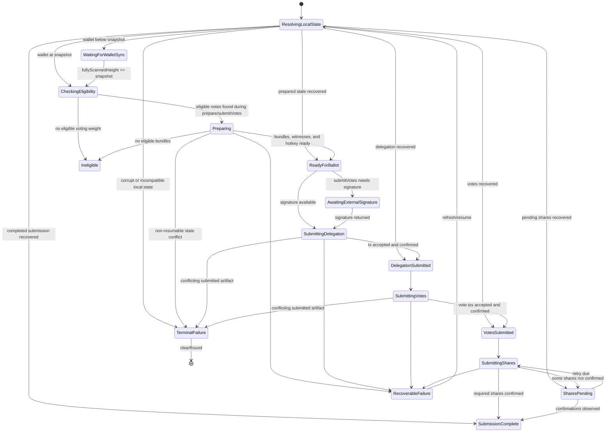

# Shielded Voting Public API Design

Status: draft

Rust API reference for this pass: `valargroup/zcash_voting@6d238ff7`.
Consumer integration reference for this pass, used as implementation context
but not as a normative Android API shape:
`valargroup/vizor-wallet@9f6e273f`.

This document proposes the Android SDK public API shape for shielded voting.
It applies the principles in `public-api-design-principles.md` to a
concrete API surface, state machine, transport boundary, and migration plan.

The main design choice is that the public API is a voting workflow capability,
not a public wrapper around `VotingRustBackend` or `TypesafeVotingBackend`.
Zodl currently owns much of the workflow in app code. This design moves that
business logic below the app boundary so a third-party wallet can integrate by
rendering SDK state, asking for user authorization, and providing transport or
signing ports.

## Goals

- Expose shielded voting from the SDK public surface.
- Make the API account-scoped and synchronizer-scoped.
- Hide JNI, voting DB handles, wallet DB paths, raw note internals, and backend
  sequencing.
- Represent the voting state machine in public SDK types.
- Keep network transport replaceable without moving workflow logic into apps.
- Treat hardware signing as a first-class workflow path.
- Keep the first API experimental.
- Use `zcash_voting` as the source of truth for reusable voting workflow,
  recovery, retry, timing, and planning rules.
- Update Zodl to use only the public SDK API.

## Non-Goals

- Do not redesign Zodl UI.
- Do not expose every internal voting DB method verbatim.
- Do not make the Android SDK the permanent source of truth for protocol
  constants or workflow invariants that belong in `zcash_voting`.
- Do not make shielded voting imply ownership of the whole Zcash governance
  protocol. Public names should say "voting" or "shielded voting", not generic
  "governance", except where mirroring an existing upstream term internally.

## Rust Ownership

The Android public API should be designed as a wallet-facing SDK facade over the
`zcash_voting` API, not as a public wrapper around Android JNI methods.

The `zcash_voting` API owns a large part of the voting workflow. The Android SDK
should treat these as the source of truth where FFI coverage exists:

- `round::VotingDb` owns voting sidecar policy, round initialization, round
  state loading, bundle validation, and policy-aware bundle planning.
- `selection`, `witness`, `precompute`, `pir`, and `tree_sync` own snapshot
  note selection, witness generation, vote-tree sync, VAN witness derivation,
  PIR endpoint selection, and delegation PIR precompute helpers.
- `delegate::PreparedDelegationBundle` owns the prepared delegation lifecycle:
  precompute, PCZT setup, proof generation, signing request construction,
  Keystone request construction, and submission assembly.
- `delegate::DelegationSigningRequest` and `DelegationSigner::signature` define
  the seedless delegation boundary. Wallet seed material stays in the wallet or
  Android SDK signing capability; Rust receives only the externally produced
  SpendAuth signature and sighash.
- `hotkey::{voting_hotkey_from_seed, generate_random_voting_hotkey}` and
  `VotingHotkey` own typed voting hotkey reconstruction. The SDK integration
  decides whether scoped hotkey seed material is stored in SDK-owned secure
  storage or in a reviewed wallet-provided store.
- `vote::{CommittedVote, SignedVoteCommitment, SignedVoteCommitments,
  commit_batch, recover_signed_commitments}` owns the cast-vote lifecycle,
  signed vote aggregate shape, batch commit flow, and persisted recovery
  reconstruction.
- `share`, `share_policy`, and `share_tracking` own helper-share payload
  recovery, nullifier derivation, submission scheduling, retry ordering, and
  share tracking summaries.
- `session::{resume_plan, Decision, NextStep, RoundPlan}` owns durable ballot
  intent and the round-level resume planner.
- `recovery::{round_snapshot, recoverable_commitment_bundle, clear}` owns typed
  recovery snapshot reporting.
- `phases::{DelegationPhase, VotePhase, SharePhase, WorkflowPhase}` owns stable
  persisted-artifact phase vocabulary for FFI and SDK state derivation.
- `wire` owns cross-language schema DTOs for protocol field names, FFI-safe
  recovery views, and wallet-facing view models such as
  `VotingRoundParams`, `VotingNoteSelectionResultView`,
  `BundleSetupResultView`, `DelegationPirPrecomputeResultView`,
  `SignedDelegationPayloadView`, `KeystoneDelegationRequestView`,
  `KeystoneSignatureRecordView`, `DraftVoteView`, `VanWitnessView`,
  `SignedVoteCommitmentsView`, `VoteRecordView`, `DelegationSubmissionWire`,
  `VoteCommitmentWire`, `VoteShareWire`, `ShareSubmissionPlanView`,
  `RoundRecoveryStateView`, and `RoundPlanView`, while crate-owned codec
  helpers own conversion, serialization, byte encoding, and JSON-safe integer
  bounds.

Rules:

- Prefer Rust-owned implementations for sidecar policy, round setup, bundle
  planning, note selection, witness and PIR precompute, delegation lifecycle,
  signing-request shaping, vote commit/recovery, share policy, wire schema and
  codec behavior, recovery snapshots, and resume planning.
- If Kotlin owns or mirrors one of those rules, document the Rust target, keep
  the logic behind the public SDK workflow boundary, and add parity tests or
  fixture tests that catch drift.
- Do not expose Android-local Kotlin orchestration as public API. Apps should see
  stable workflow capabilities and typed state, regardless of whether the first
  implementation is Rust-owned, Kotlin-owned, or split across both.
- Configuration parsing, authentication, and switch planning do not yet have an
  equivalent `zcash_voting` module. Until they do, Kotlin may own them behind
  this SDK API, with the same rule: apps must not parse, authenticate, diff, or
  invalidate voting config state themselves.
- Configuration parsing includes proposal and option extraction, fallback field
  handling for evolving config JSON, labels, option counts, and proposal ID
  validation. Treat these as SDK-owned rules, not app UI helpers.
- Share scheduling, last-moment behavior, single-share fallback, retry timing,
  and share-tracking readiness should converge on Rust-owned
  `share_policy` / `share_tracking` behavior. If Kotlin temporarily owns any
  share timing policy during the first Android implementation, keep it behind
  the SDK workflow boundary, document it as a migration step, and add parity
  tests against the Rust target.
- Direct Rust consumers, Android SDK consumers, and future SDKs should converge
  on the same high-level behavior. Divergence is acceptable only when it is
  documented as a temporary migration step.

## Package Layout

Public API:

```text
cash.z.ecc.android.sdk.voting
cash.z.ecc.android.sdk.model.voting
```

Internal adapters:

```text
cash.z.ecc.android.sdk.internal.voting
cash.z.ecc.android.sdk.internal.model.voting
```

Rules:

- `cash.z.ecc.android.sdk.voting` contains capabilities, workflow interfaces,
  transport ports, signing ports, and optional hotkey authority or storage
  ports.
- `cash.z.ecc.android.sdk.model.voting` contains public domain models.
- `cash.z.ecc.android.sdk.internal.*` contains JNI carriers, backend adapters,
  note mapping, wallet DB access, Rust error mapping, and persistence wiring.

## Stability Annotation

The first public API should be opt-in:

```kotlin
@RequiresOptIn(
    message = "The shielded voting API is experimental and may change.",
    level = RequiresOptIn.Level.ERROR
)
annotation class ExperimentalVotingApi
```

All public voting types, methods, and extension points should be annotated with
`@ExperimentalVotingApi`.

## Distribution And Opt-In

The Android API should be visible from the public SDK surface, but explicitly
opted into by consumers.

Recommended Android placement:

- Put the wallet-facing API packages in `sdk-lib` so the stable entry point can
  be `Synchronizer.voting`.
- Keep `backend-lib`, JNI carriers, Rust wrappers, and database handles
  internal implementation details.
- Gate the API with `@ExperimentalVotingApi` and an explicit Gradle
  feature/artifact mechanism so wallets choose whether to include shielded
  voting.
- Do not require `sdk-incubator-lib` as the primary shape. It can remain a
  compatibility mechanism if release engineering needs it, but the preferred
  long-term model is platform-native feature selection plus API opt-in.

The iOS SDK should expose an equivalent consumer-facing structure if it adopts
shielded voting: a main Swift SDK product for stable wallet APIs, a Swift-native
experimental opt-in mechanism, and an explicit package/product or trait-style
selection mechanism when the Swift tools version supports it. The Swift API
does not need identical packaging internals, but the app-facing workflow should
match Android as closely as platform conventions allow.

## Public Entry Point

`Synchronizer` gets a voting capability, following the existing `broadcaster`
capability pattern:

```kotlin
interface Synchronizer {
    /**
     * Shielded voting capability scoped to this synchronizer's wallet data and
     * network.
     */
    @ExperimentalVotingApi
    val voting: Voting
        get() = UnavailableVoting
}
```

The SDK-backed synchronizer provides a real implementation. Test or unavailable
synchronizers can keep the default object that throws `VotingException.Unavailable`.

## Capability Shape

The top-level capability is synchronizer-scoped. Account-specific work binds an
`AccountUuid` and returns an account-scoped workflow surface.

```kotlin
@ExperimentalVotingApi
interface Voting {
    /**
     * Returns a voting workflow capability for an account tracked by this
     * synchronizer.
     */
    fun forAccount(accountUuid: AccountUuid): AccountVoting

    /**
     * Resolves and authenticates the current voting configuration. The SDK owns
     * parsing, hash validation, signature validation, supported-version checks,
     * and round authentication. The transport only fetches untrusted payloads.
     */
    suspend fun resolveConfiguration(
        request: ResolveVotingConfigurationRequest,
        transport: VotingConfigTransport
    ): VotingConfigurationPlan

    /**
     * Applies a previously resolved configuration plan and performs SDK-owned
     * local state reconciliation before making the configuration current.
     */
    suspend fun applyConfigurationPlan(
        plan: VotingConfigurationPlan
    ): VotingConfiguration

    /**
     * Warms proving resources used by voting. Safe to call at app startup.
     */
    suspend fun warmProvingCaches()
}

@ExperimentalVotingApi
interface AccountVoting {
    /**
     * Returns a workflow handle for an authenticated round. State
     * reconciliation happens in refresh, prepare, submitVotes, or resume.
     */
    fun round(round: AuthenticatedVotingRound): VotingRoundWorkflow

    /**
     * Lists rounds with local SDK voting state for this account.
     */
    suspend fun listLocalRounds(): List<VotingRoundSummary>

    /**
     * Clears all local voting state for a round.
     */
    suspend fun clearRound(roundId: VotingRoundId)
}
```

Important properties:

- The app does not open a voting DB.
- The app does not know the voting DB path.
- The app does not pass a raw wallet ID string.
- The app does not pass a raw DB handle.
- The app does not build `VotingNoteInfo`.
- The app does not close account or round voting capabilities. The
  synchronizer and SDK implementation own voting resource lifecycle.
- Active `Flow` collections are cancelled by the collector or completed by the
  operation. If the synchronizer stops while voting work is active, the SDK
  publishes or throws a typed failure rather than requiring callers to repair
  internal resources.

Workflow identity:

- A round workflow is identified by synchronizer instance, `AccountUuid`, and
  `VotingRoundId`.
- Multiple calls for the same identity may return the same object or separate
  lightweight handles, but all returned handles must observe the same durable
  SDK workflow state.
- A `StateFlow` collector from an earlier handle must continue receiving state
  changes caused by later calls for the same identity. The implementation must
  not create disconnected state sources for the same account and round.

## Workflow Surface

`VotingRoundWorkflow` is the primary product API. It owns preparation,
submission, recovery, share tracking, and signing transitions for one account in
one authenticated round.

```kotlin
@ExperimentalVotingApi
interface VotingRoundWorkflow {
    /**
     * Current durable SDK view of this account's voting workflow for the round.
     */
    val state: StateFlow<VotingWorkflowSnapshot>

    /**
     * Refreshes derived state without performing irreversible actions. This can
     * check wallet sync, local round state, recovery state, and remote share or
     * transaction status through the supplied transport.
     */
    suspend fun refresh(
        request: RefreshVotingRoundRequest,
        transport: VotingTransport
    ): VotingWorkflowSnapshot

    /**
     * Prepares the account for the round without submitting votes. This is an
     * optional preflight/warm-up operation. `submitVotes` also performs this
     * reconciliation when required, so callers are not required to call
     * `prepare` first.
     */
    fun prepare(
        request: PrepareVotingRoundRequest,
        transport: VotingTransport
    ): Flow<VotingWorkflowEvent>

    /**
     * Submits votes for one or more proposals. The SDK first refreshes local
     * state, prepares missing bundles/hotkey state when needed, and resumes any
     * already-started submission. It then owns delegation submission, vote
     * commitment construction, transaction submission, confirmation probing,
     * share payload creation, share submission, retry timing, and recovery
     * persistence.
     */
    fun submitVotes(
        request: SubmitVotesRequest,
        transport: VotingTransport
    ): Flow<VotingWorkflowEvent>

    /**
     * Resumes interrupted work using SDK recovery state.
     */
    fun resume(
        request: ResumeVotingRequest,
        transport: VotingTransport
    ): Flow<VotingWorkflowEvent>

    /**
     * Checks pending helper share submissions and performs SDK-owned retries
     * when policy says they are due. This is an idempotent maintenance trigger,
     * not an app-owned workflow step.
     */
    fun trackShares(
        request: TrackVotingSharesRequest,
        transport: VotingTransport
    ): Flow<VotingWorkflowEvent>
}
```

This API intentionally does not expose operations named like
`storeWitnesses`, `storeVanPosition`, `markVoteSubmitted`, or
`recordShareDelegation`. Those are implementation and recovery details of the
workflow.

Implementation should be driven by Rust workflow primitives rather than
Android-local phase reconstruction. `prepare` should use Rust-owned round,
selection, bundle, witness, and prepared-delegation APIs. `submitVotes` and
`resume` should record ballot intent, consult `session::resume_plan`, execute
one or more `NextStep`s, then refresh the public snapshot from
`recovery::round_snapshot` and phase APIs. `trackShares` should use
`share_policy`, `share`, and `share_tracking` APIs for retry timing, target
selection, and durable confirmation state.

`session::resume_plan` should be the primary Rust planner input for deciding
what work the SDK performs next. `recovery::round_snapshot` supplies durable
artifact details needed to build `VotingWorkflowSnapshot` and diagnostics. If
the Android SDK must combine both, that mapping stays internal and must not
become app-visible planner logic.

`refresh` is a `suspend` method because it performs one bounded reconciliation
and returns one snapshot. `prepare`, `submitVotes`, `resume`, and `trackShares`
return `Flow` because they can perform long-running proof, network, retry, or
recovery work and need to stream progress and state changes.

Long-running `Flow` methods are foreground workflow operations on Android.
Cancelling collection cancels the in-flight coroutine work, but any durable
state already written by the SDK remains recoverable. The SDK does not continue
submission after the app leaves the voting screen; callers should use `refresh`
or `resume` when the user returns.

## App Integration Model

The app owns UI, consent, hardware interaction, and transport wiring. The SDK
owns voting decisions.

Pre-confirmation ballot drafts are app-owned UI state. Durable ballot intent
starts when the user submits or resumes a submission: the SDK persists the
intent before irreversible vote work and uses it as recovery input for
`session::resume_plan`. Apps should not maintain a second durable recovery model
that competes with SDK ballot intent.

Example:

```kotlin
@OptIn(ExperimentalVotingApi::class)
suspend fun submitFromWallet(
    synchronizer: Synchronizer,
    accountUuid: AccountUuid,
    configTransport: VotingConfigTransport,
    votingTransport: VotingTransport,
    signingAuthority: VotingSigningAuthority,
    choices: VotingBallot
) {
    val configurationPlan =
        synchronizer.voting.resolveConfiguration(
            request = ResolveVotingConfigurationRequest.Bundled,
            transport = configTransport
        )
    val config = synchronizer.voting.applyConfigurationPlan(configurationPlan)

    val round = config.requireActiveRound(choices.roundId)
    val workflow = synchronizer.voting.forAccount(accountUuid).round(round)

    workflow.submitVotes(
        request = SubmitVotesRequest(
            ballot = choices,
            signingAuthority = signingAuthority
        ),
        transport = votingTransport
    ).collect { event ->
        when (event) {
            is VotingWorkflowEvent.StateChanged -> render(event.snapshot)
            is VotingWorkflowEvent.Progress -> renderProgress(event.progress)
            is VotingWorkflowEvent.UserActionRequired -> renderAction(event.action)
        }
    }
}
```

The app never calls `prepare` to satisfy a hidden precondition for `submitVotes`,
and it never calls `buildVoteCommitment`, `syncVoteTree`, or `buildSharePayloads`
directly. If the SDK needs those steps, it performs them as part of
`submitVotes` or `resume`.

Normal callers should not need to provide hotkey storage. The SDK should resolve
scoped hotkey material through its default hotkey authority unless a wallet has a
reviewed requirement for custom hotkey persistence.

## State Machine

The public workflow state must be documented and testable. This target state
machine describes one account's local workflow for one authenticated round. It
is the SDK's public contract; it is not a direct export of Rust, JNI, app
recovery, or share-tracking states.

Round lifecycle is separate from account workflow state. Round status remains
available through `AuthenticatedVotingRound.status` so the app can distinguish
an active round from a cancelled, tallying, or tallied round. A local workflow
may still be `SharesPending` while the round has moved to tallying.



`RecoverableFailure` means local state is still valid and the SDK can resume.
`TerminalFailure` means the SDK cannot safely continue from local state without
caller-confirmed cleanup, for example because authenticated round parameters no
longer match persisted state, persisted recovery state is corrupt, or a
submitted artifact conflicts with durable ballot intent. The app should render
the failure and offer a clear/abandon action that calls `clearRound`; it should
not repair storage rows itself.

Recovery is modeled as SDK reconciliation: `refresh` or `resume` reads durable
SDK state, remote confirmations, and wallet sync state, then lands the workflow
in the most accurate public phase.

Low-level operations such as vote commitment construction, vote tree sync,
share-payload creation, witness generation, and database writes are not public
workflow phases. The SDK may expose them as `VotingProgress` details, but the
app does not sequence them.

## Workflow Snapshot

The app renders this state. It does not derive workflow state from voting DB
rows itself.

```kotlin
@ExperimentalVotingApi
data class VotingWorkflowSnapshot(
    val round: AuthenticatedVotingRound,
    val accountUuid: AccountUuid,
    val phase: VotingWorkflowPhase,
    val eligibility: VotingEligibility,
    val preparedBundles: VotingPreparedBundles?,
    val submittedVotes: List<VotingSubmittedVote>,
    val pendingShares: List<VotingPendingShare>,
    val nextAction: VotingUserAction?,
    val lastFailure: VotingFailure?
)

@ExperimentalVotingApi
sealed interface VotingWorkflowPhase {
    data object ResolvingLocalState : VotingWorkflowPhase
    data object WaitingForWalletSync : VotingWorkflowPhase
    data object CheckingEligibility : VotingWorkflowPhase
    data object Ineligible : VotingWorkflowPhase
    data object Preparing : VotingWorkflowPhase
    data object ReadyForBallot : VotingWorkflowPhase
    data object AwaitingExternalSignature : VotingWorkflowPhase
    data object SubmittingDelegation : VotingWorkflowPhase
    data object DelegationSubmitted : VotingWorkflowPhase
    data object SubmittingVotes : VotingWorkflowPhase
    data object VotesSubmitted : VotingWorkflowPhase
    data object SubmittingShares : VotingWorkflowPhase
    data object SharesPending : VotingWorkflowPhase
    data object SubmissionComplete : VotingWorkflowPhase
    data object RecoverableFailure : VotingWorkflowPhase
    data object TerminalFailure : VotingWorkflowPhase
}
```

`VotingWorkflowPhase` is intentionally app-readable. It is the public state
machine vocabulary for local account progress, not a mirror of internal storage
rows or round lifecycle status.

`zcash_voting::phases::WorkflowPhase` is an input to this state machine, not the
entire Android public state machine. Rust owns the stable per-artifact phase
derivation for delegation, vote, and share rows. The Android SDK maps those
artifact phases, wallet sync state, round status, remote confirmations, and
pending signing requests into the richer app-readable `VotingWorkflowPhase`
values above.

## Events And Progress

Long-running methods return `Flow<VotingWorkflowEvent>` so UI can react without
owning sequencing.

```kotlin
@ExperimentalVotingApi
sealed interface VotingWorkflowEvent {
    data class StateChanged(
        val snapshot: VotingWorkflowSnapshot
    ) : VotingWorkflowEvent

    data class Progress(
        val progress: VotingProgress
    ) : VotingWorkflowEvent

    data class UserActionRequired(
        val action: VotingUserAction
    ) : VotingWorkflowEvent
}

@ExperimentalVotingApi
sealed interface VotingProgress {
    data class ResolvingPir(
        val fraction: PercentDecimal?
    ) : VotingProgress

    data class Preparing(
        val fraction: PercentDecimal?
    ) : VotingProgress

    data class Authorizing(
        val fraction: PercentDecimal?
    ) : VotingProgress

    data class SyncingVoteTree(
        val fraction: PercentDecimal?
    ) : VotingProgress

    data class Submitting(
        val current: Int,
        val total: Int,
        val fraction: PercentDecimal?
    ) : VotingProgress

    data class TrackingShares(
        val ready: Int,
        val overdue: Int,
        val waiting: Int
    ) : VotingProgress
}

@ExperimentalVotingApi
sealed interface VotingUserAction {
    data class ConfirmSubmission(
        val ballot: VotingBallot
    ) : VotingUserAction
}
```

`UserActionRequired` represents app-owned UI consent. Signing work is modeled
through explicit signing capabilities, not as transport behavior or hidden app
callbacks.

`VotingProgress` details are app-readable telemetry, not caller-owned
sub-steps. The SDK may report long-running PIR resolution, vote-tree sync,
proof generation, submission, and share tracking, but callers should not derive
workflow state from progress events.

External signing is not a `VotingUserAction` event by itself. When the workflow
needs a signature, `submitVotes` or `resume` invokes the supplied
`VotingSigningAuthority`. The public state still moves through
`AwaitingExternalSignature` so UI can render that signing is in progress or can
be resumed after process death.

## Signing Model

Voting submission needs signing authority and scoped hotkey material. The SDK
asks these authorities for the minimum material required at each workflow point.

This mirrors the `zcash_voting` signing boundary: Rust no longer accepts wallet
seed material for delegation signing. It constructs a
`DelegationSigningRequest`, the wallet or SDK-local signer produces a SpendAuth
signature over the requested sighash, and Rust receives only the signature plus
the sighash. Voting hotkeys follow the same principle: software-wallet flows
derive a scoped hotkey seed from wallet seed material plus round/account/network
context, while hardware-wallet flows generate a random per-round hotkey seed
because the host app does not have the hardware wallet seed.

```kotlin
@ExperimentalVotingApi
interface VotingSigningAuthority {
    /**
     * Produces the SpendAuth signature requested by the SDK for delegation.
     * Implementations may use local software keys, a hardware signer, or any
     * wallet-owned signing service.
     */
    suspend fun signDelegation(
        request: VotingDelegationSigningRequest
    ): VotingDelegationSignature
}

@ExperimentalVotingApi
interface VotingHotkeyAuthority {
    /**
     * Loads, creates, or derives scoped voting hotkey material for this account
     * and round. Root wallet seed material must not cross this boundary.
     */
    suspend fun votingHotkey(scope: VotingHotkeyScope): VotingHotkeySeed
}

@ExperimentalVotingApi
interface VotingSoftwareSigningProvider {
    /**
     * Optional SDK convenience boundary for wallets that want the Android SDK
     * to implement [VotingSigningAuthority] locally for software accounts.
     */
    suspend fun signDelegation(
        request: VotingDelegationSigningRequest
    ): VotingDelegationSignature
}
```

`VotingSigningAuthority.signDelegation` is the single public delegation-signing
port. A wallet can implement it with local software keys, a QR/UR Keystone flow,
USB/Bluetooth device flow, or any other external signer. The SDK must persist
the pending request before invoking the port, including enough identity to
reject signatures for the wrong round, account, bundle, action, sighash,
randomizer, or seed fingerprint.
Once the SDK invokes `signDelegation`, the workflow must already be durably
recoverable as `AwaitingExternalSignature`.

`VotingHotkeyAuthority` is separate from `VotingSigningAuthority` because scoped
hotkey storage and delegation signing are different permissions. The first
Android implementation should prefer an SDK-provided hotkey authority backed by
SDK-owned secure storage. If a wallet needs custom hotkey storage, expose that
as a reviewed extension point rather than mixing hotkey persistence into
transport or signing.

`VotingSoftwareSigningProvider` is an optional convenience adapter, not the core
API shape. It should not expose a reusable `UnifiedSpendingKey` through the
voting API. If the Android SDK provides a software-wallet implementation, it
should derive the account SpendAuth key inside the wallet boundary, produce the
requested signature, and pass only the signature to `zcash_voting`.

Cancellation and process death rules:

- Kotlin coroutine cancellation remains cancellation and must not be wrapped as
  `VotingException.SigningDeclined`.
- `VotingException.SigningDeclined` means the signing authority completed
  without a signature because the user or wallet declined signing, for example
  by dismissing hardware-device UI.
- If `SigningDeclined` is thrown, the SDK has already persisted the pending
  signing request and the workflow is safe to resume from
  `AwaitingExternalSignature`.
- If the app process dies while signing is in progress, `refresh` or `resume`
  must recover the same pending signing request.
- `refresh` or `resume` reissues the same logical signing request through the
  signing authority when the caller resumes the workflow.
- Duplicate signatures and signatures for a different pending request are
  rejected as typed workflow failures, not silently accepted or left for the app
  to classify.
- After a signature is accepted and persisted, re-running `submitVotes` or
  `resume` must reuse the stored validated signature rather than asking the
  signing authority again.

`VotingHotkeyStore` should not be part of the first product API unless a
concrete wallet requirement needs custom persistence. Keeping it internal gives
third-party wallets one fewer secret-storage interface to implement, while the
public workflow API can stay stable if the SDK later exposes a custom store.

```kotlin
@ExperimentalVotingApi
interface VotingHotkeyStore {
    suspend fun load(scope: VotingHotkeyScope): VotingHotkeySeed?
    suspend fun store(scope: VotingHotkeyScope, seed: VotingHotkeySeed)
    suspend fun clear(scope: VotingHotkeyScope)
}
```

If exposed, `VotingHotkeyStore` is only a secret-storage port. It must not be
able to sign delegation requests, inspect transport payloads, or access root
wallet seed material. The SDK still owns when a hotkey is created, reused, or
cleared.

`VotingHotkeySeed` is secret, scoped, persistable material used only to
reconstruct a `zcash_voting::VotingHotkey` for one voting context. For software
accounts, the SDK derives it from wallet seed material plus `VotingHotkeyScope`.
For hardware accounts, the SDK generates random per-round material and stores it
for recovery because the hardware seed is unavailable. It must not be
transmitted, logged, displayed, or treated as a root wallet seed.

## Transport Model

Transport is a port. The SDK decides what needs to be done; the transport
performs network IO.

```kotlin
@ExperimentalVotingApi
interface VotingConfigTransport {
    suspend fun fetchStaticConfig(source: VotingStaticConfigSource): VotingConfigPayload.Static
    suspend fun fetchDynamicConfig(url: VotingHttpsUrl): VotingConfigPayload.Dynamic
}

@ExperimentalVotingApi
interface VotingTransport {
    suspend fun fetchDelegationPirPrecompute(
        endpoint: VotingPirEndpoint,
        request: VotingDelegationPirRequest
    ): VotingDelegationPirResponse

    suspend fun submitDelegation(
        endpoint: VotingServerEndpoint,
        request: VotingDelegationSubmissionRequest
    ): VotingDelegationSubmissionResponse

    suspend fun submitVote(
        endpoint: VotingServerEndpoint,
        request: VotingVoteSubmissionRequest
    ): VotingVoteSubmissionResponse

    suspend fun submitShare(
        endpoint: VotingServerEndpoint,
        request: VotingShareSubmissionRequest
    ): VotingShareSubmissionResponse

    suspend fun queryShare(
        endpoint: VotingServerEndpoint,
        request: VotingShareQueryRequest
    ): VotingShareQueryResponse

    suspend fun fetchVoteTree(
        endpoint: VotingServerEndpoint,
        request: VotingTreeRequest
    ): VotingTreeResponse

    suspend fun queryTransaction(
        endpoint: VotingServerEndpoint,
        txId: TransactionId
    ): VotingTransactionStatus
}
```

The SDK should also provide a convenience implementation, for example a Ktor
transport, but callers can provide their own transport for custom networking or
privacy routing.

Transport method names should describe the IO being performed, not the workflow
step that needs the IO. For example, `fetchDelegationPirPrecompute` is a remote
request to the selected PIR endpoint for PIR precompute data; proof generation
and local precompute state remain SDK/Rust workflow responsibilities.

The transport must not expose the app to internal workflow calls like
`storeVanPosition` or `markShareConfirmed`. It returns typed protocol responses
that the SDK validates and persists.

Request payloads should be shaped through the Rust-owned wire schema and codec
boundary where possible. The Android SDK should not duplicate delegation
submission, vote commitment, helper-share, recovery snapshot, or share-planning
field names, base64 shaping, or JSON-safe integer checks.

Android JNI cannot scan `zcash_voting::wire` directly the way FRB consumers can.
Prefer Rust-owned serialization or conversion across the JNI boundary for
protocol wire payloads and recovery view DTOs, such as canonical JSON strings or
byte payloads generated by `zcash_voting` wire/codec helpers. If the Android
adapter uses hand-matched JNI carriers, add golden parity tests against Rust
wire serialization so Kotlin does not become the owner of protocol field names.

## Configuration And Round Authentication

The SDK owns config parsing, authentication, switch planning, and local
invalidation. The transport only fetches untrusted bytes.

```kotlin
@ExperimentalVotingApi
sealed interface ResolveVotingConfigurationRequest {
    data object Bundled : ResolveVotingConfigurationRequest

    data class StaticSource(
        val source: VotingStaticConfigSource
    ) : ResolveVotingConfigurationRequest

    data class Bytes(
        val staticConfig: VotingConfigPayload.Static,
        val expectedStaticSha256: VotingSha256?,
        val dynamicConfig: VotingConfigPayload.Dynamic?
    ) : ResolveVotingConfigurationRequest
}

@ExperimentalVotingApi
data class VotingConfigurationPlan(
    val previousFingerprint: VotingConfigurationFingerprint?,
    val newFingerprint: VotingConfigurationFingerprint,
    val configuration: VotingConfiguration,
    val switchKind: VotingConfigurationSwitchKind
)

@ExperimentalVotingApi
enum class VotingConfigurationSwitchKind {
    Unchanged,
    InitialLoad,
    SameChainServiceUpdate,
    NewChainOrRound,
    ProtocolChanged
}

@ExperimentalVotingApi
data class VotingConfiguration(
    val staticSource: VotingStaticConfigSource?,
    val voteServers: List<VotingServerEndpoint>,
    val pirServers: List<VotingPirEndpoint>,
    val rounds: List<AuthenticatedVotingRound>,
    val supportedVersions: VotingSupportedVersions
)

@ExperimentalVotingApi
data class AuthenticatedVotingRound(
    val id: VotingRoundId,
    val title: String,
    val description: String,
    val discussionUrl: String?,
    val snapshotHeight: BlockHeight,
    val createdAtHeight: BlockHeight,
    val votingStartsAt: Instant,
    val votingEndsAt: Instant,
    val status: VotingRoundStatus,
    val proposals: List<VotingProposal>,
    val encryptionAuthorityPublicKey: VotingEncryptionAuthorityPublicKey,
    val noteCommitmentRoot: VotingNoteCommitmentRoot,
    val nullifierImtRoot: VotingNullifierImtRoot,
    val session: VotingSessionMetadata
)
```

`VotingConfigurationSwitchKind.Unchanged` means the authenticated configuration
can become current without clearing or rewriting local voting workflow state.
`AuthenticatedVotingRound.session` is authenticated, parsed SDK-domain metadata
for the round. Raw static or dynamic config bytes do not cross this model
boundary.

Apps may choose a config source. They should not reimplement hash pinning,
signature verification, version checks, round authentication, config-diffing, or
local invalidation.

`resolveConfiguration` does not make a newly fetched configuration current by
itself. It authenticates the config, compares it with SDK-managed local config
state, and returns a semantic switch plan. `applyConfigurationPlan` persists the
new current configuration and performs SDK-owned state reconciliation in one
serialized operation. The app may render `plan.switchKind` for user context,
but it must not classify changed config fields, delete SDK recovery
rows, reset private tree clients, clear pending signatures, or rewrite server
state itself.

Applying a stale or replayed plan must be serialized against the current SDK
configuration state. It should fail with `VotingException.ConfigurationPlanConflict`
unless the plan is already current and can be treated as an idempotent no-op.
The chosen idempotency rule must be documented and tested.

The Android API should expose a semantic switch model instead of field-by-field
invalidation reasons:

- `InitialLoad` applies when no previous authenticated configuration exists.
- `Unchanged` applies when the authenticated configuration does not require
  local workflow state changes.
- `SameChainServiceUpdate` applies when service data changes while the same
  chain and round context remain usable. The SDK should restart endpoint caches,
  status polls, share tracking, and PIR/delegation precompute as needed, while
  preserving round-id-indexed wallet artifacts.
- `NewChainOrRound` applies when the authenticated round set or chain context
  changes. The SDK should discard or reselect the active visible round context,
  while keeping durable state for old round IDs scoped by normal cleanup policy.
- `ProtocolChanged` applies when cached voting state cannot safely be reused
  until compatibility is re-established.

Static hash pinning, dynamic signature verification, supported-version checks,
round authentication, and switch classification do not yet have a shared
`zcash_voting` module. Kotlin can own this during the first Android API release,
but the implementation must stay isolated behind this SDK API and covered by
tests so it can later move into Rust without changing the app-facing shape.

Raw config payload rules:

- Config bytes are public but untrusted until `resolveConfiguration` succeeds.
- Payload wrappers copy bytes on input and output and redact contents from
  `toString()`.
- The SDK must enforce maximum static and dynamic config sizes before parsing.
- Logs may include source, byte count, and hash. They must not include raw config
  contents.
- `VotingConfigTransport` implementations should return exactly the bytes from
  the selected source. They should not parse, authenticate, normalize, or rewrite
  config JSON.

## Domain Models

Minimum public model set:

```kotlin
@JvmInline value class VotingRoundId(val value: String)
@JvmInline value class VotingProposalId(val value: Int)
@JvmInline value class VotingOptionIndex(val value: Int)
@JvmInline value class VotingOptionCount(val value: Int)
@JvmInline value class VotingBundleIndex(val value: Int)
@JvmInline value class VotingShareIndex(val value: Int)
@JvmInline value class VotingWeight(val value: Zatoshi)
@JvmInline value class VotingHttpsUrl private constructor(val value: String)
@JvmInline value class VotingProtocolVersion(val value: String)

data class VotingBallot(
    val roundId: VotingRoundId,
    val choices: List<VotingChoice>
)

data class VotingChoice(
    val proposalId: VotingProposalId,
    val option: VotingOptionIndex
)

data class VotingEligibility(
    val status: VotingEligibilityStatus,
    val eligibleWeight: VotingWeight,
    val bundleCount: Int,
    val reason: VotingIneligibilityReason?
)

data class VotingBundlePolicy(
    val maxRealNotesPerBundle: Int
)

data class VotingHotkeyScope(
    val network: ZcashNetwork,
    val accountUuid: AccountUuid,
    val roundId: VotingRoundId
)

sealed interface VotingEligibilityStatus {
    data object Unknown : VotingEligibilityStatus
    data object Eligible : VotingEligibilityStatus
    data object Ineligible : VotingEligibilityStatus
    data class WalletSyncing(
        val scannedHeight: BlockHeight?,
        val snapshotHeight: BlockHeight
    ) : VotingEligibilityStatus
}

data class VotingStaticConfigSource(
    val url: VotingHttpsUrl,
    val expectedSha256: VotingSha256?
)

data class VotingServerEndpoint(
    val url: VotingHttpsUrl,
    val label: String?
)

data class VotingPirEndpoint(
    val url: VotingHttpsUrl,
    val label: String?
)

data class VotingSupportedVersions(
    val voteServer: VotingProtocolVersion,
    val voteProtocol: VotingProtocolVersion,
    val tally: VotingProtocolVersion,
    val pir: List<VotingProtocolVersion>
)

data class VotingSessionMetadata(
    val ceremonyStartsAt: Instant?,
    val voteEndsAt: Instant,
    val lastMomentBuffer: Duration?
)
```

`VotingConfigurationSwitchKind` is defined in the configuration section above.
It is listed there rather than repeated here so the draft has a single canonical
switch model.

`VotingBundlePolicy` maps to `zcash_voting::BundlePolicy`. The default Android
API should use the Rust default unless a caller explicitly opts into a different
bundle policy.

`VotingHotkeyScope` is the complete public context for scoped hotkey derivation
and persistence. It must not include root wallet seed material or raw database
paths. If the implementation needs lower-level values such as account index or
seed fingerprint, it resolves them inside the SDK/wallet boundary.

`VotingSessionMetadata` is authenticated, parsed metadata that the SDK needs for
timing and workflow policy. The first shape should include the round timing
needed for helper-share scheduling and last-moment voting behavior. Raw static
or dynamic config JSON should not be exposed as session metadata.

`zcash_voting::session::RoundPlan` and `NextStep` are planner internals. They
may be used inside the SDK implementation and may be exposed through a
diagnostic or debug-only surface, but they should not be part of the primary
wallet-facing public model set because apps are not supposed to execute
individual planner steps.

Byte-bearing models:

```kotlin
data class VotingEncryptionAuthorityPublicKey private constructor(...)
data class VotingNoteCommitmentRoot private constructor(...)
data class VotingNullifierImtRoot private constructor(...)
data class VotingSha256 private constructor(...)
data class VotingConfigurationFingerprint private constructor(...)
sealed class VotingConfigPayload private constructor(...) {
    class Static private constructor(...) : VotingConfigPayload(...)
    class Dynamic private constructor(...) : VotingConfigPayload(...)
}
data class VotingDelegationSigningRequest(...)
data class VotingDelegationSignature(...)
data class VotingKeystoneSigningRequest(...)
data class VotingShareNullifier(...)
data class VotingDelegationArtifact(...)
data class VotingVoteArtifact(...)
data class VotingSharePayload(...)
data class VotingHotkeySeed(...)
```

Requirements for byte-bearing models:

- Validate known sizes at construction.
- Enforce documented maximum sizes for variable-size payloads before parsing.
- Copy byte arrays on input and output.
- Redact `toString()` for secrets and sensitive recovery artifacts.
- KDoc must state whether bytes are secret, persistable, transmittable, or
  display-only.

Prefer existing SDK models where they already fit:

- `AccountUuid`
- `BlockHeight`
- `PercentDecimal`
- `Pczt`
- `TransactionId`
- `UnifiedFullViewingKey`
- `Zatoshi`
- `ZcashNetwork`
- `Zip32AccountIndex`

## Error Model

Public voting failures should be typed.

```kotlin
@ExperimentalVotingApi
sealed class VotingException(
    message: String,
    cause: Throwable? = null
) : SdkException(message, cause) {
    class Unavailable(cause: Throwable? = null) : VotingException(...)
    class InvalidConfiguration(...) : VotingException(...)
    class ConfigurationPlanConflict(...) : VotingException(...)
    class UnsupportedVersion(...) : VotingException(...)
    class AccountUnavailable(...) : VotingException(...)
    class WalletNotSynced(...) : VotingException(...)
    class Ineligible(...) : VotingException(...)
    class InvalidRoundState(...) : VotingException(...)
    class InvalidSignature(...) : VotingException(...)
    class SigningDeclined(...) : VotingException(...)
    class Transport(...) : VotingException(...)
    class Storage(...) : VotingException(...)
    class Backend(...) : VotingException(...)
}
```

Rules:

- Expected workflow states should be values in `VotingWorkflowSnapshot`, not
  exceptions.
- Exceptions are for failed operations, invalid inputs, transport failures, and
  backend/storage faults.
- Raw JNI/Rust `RuntimeException` must be caught and wrapped before crossing the
  public boundary.

## Mapping Current Zodl Logic Into SDK

Current Zodl code should move as follows:

| Zodl component                     | SDK destination                                                                                                                                                                           |
| ---------------------------------- | ----------------------------------------------------------------------------------------------------------------------------------------------------------------------------------------- |
| `VotingCryptoClient`               | Removed from Zodl. Replaced by internal SDK adapter behind `VotingRoundWorkflow`.                                                                                                         |
| `PrepareVotingRoundUseCase`        | Moved into `VotingRoundWorkflow.prepare` and the preparatory reconciliation inside `submitVotes`.                                                                                         |
| `SubmitVotesUseCase`               | Moved into `VotingRoundWorkflow.submitVotes` and `resume`.                                                                                                                                |
| `TrackVotingSharesUseCase`         | Moved into `VotingRoundWorkflow.trackShares`.                                                                                                                                             |
| `VotingRecoveryRepository`         | Replaced by SDK voting sidecar/Rust recovery state plus SDK-owned scoped hotkey storage unless a reviewed custom store requirement emerges.                                                |
| `VotingApiProvider`                | Becomes a `VotingTransport` implementation or is replaced by SDK convenience transport.                                                                                                   |
| `VotingConfigRepository`           | Becomes config-source selection plus `VotingConfigTransport`; parsing, authentication, config switch planning, and invalidation move into SDK.                                            |
| Keystone PCZT use cases            | Become a `VotingSigningAuthority` implementation, hotkey-authority path, and UI routing. SDK owns pending request persistence, request construction, duplicate/wrong-signature detection, and signature validation. |
| `VotingErrors` and progress models | Replaced by `VotingWorkflowSnapshot`, `VotingWorkflowEvent`, `VotingException`, and typed failure states.                                                                                 |

The app should end up with no imports from:

```text
cash.z.ecc.android.sdk.internal.*
cash.z.ecc.android.sdk.internal.jni.*
cash.z.ecc.android.sdk.internal.model.voting.*
```

## Mapping Current Internal Operations

Current internal operations still exist, but they are not the public workflow
contract.

| Internal operation                                                                                                  | Public treatment                                                                                                                   |
| ------------------------------------------------------------------------------------------------------------------- | ---------------------------------------------------------------------------------------------------------------------------------- |
| `openVotingDb`, `close`                                                                                             | Hidden behind `Voting.forAccount` and `VotingRoundWorkflow`; internal implementation should use `VotingDb::open_wallet_sidecar` where possible. |
| `getWalletNotes`, `VotingNoteInfoMapper`                                                                            | Hidden. SDK sources notes from the wallet DB and maps through `zcash_voting::selection` / `NoteInfo` helpers.                      |
| `initRound`                                                                                                         | Internal step in `round(...)`, `refresh`, or `prepare`; should use `VotingDb::ensure_round_state`.                                 |
| `computeBundleSetup`, `setupBundles`                                                                                | Internal steps in `prepare`; should use `VotingDb::ensure_bundles*` and `BundlePolicy`. Public output appears as `VotingEligibility` / `VotingPreparedBundles`. |
| `generateHotkey`, `deriveHotkeyRawAddress`                                                                          | Internal steps using scoped `VotingHotkeySeed` storage and `zcash_voting::hotkey` helpers.                                        |
| `buildGovernancePczt*`                                                                                              | Internal delegation setup through `PreparedDelegationBundle::setup` / `keystone_request`. Public names use `VotingDelegation*`.    |
| `extractPcztSighash`, `extractSpendAuthSig`                                                                         | Internal signing validation helpers. Only typed `VotingDelegationSigningRequest`, `VotingKeystoneSigningRequest`, and `VotingDelegationSignature` are public. |
| `precomputeDelegationPir`, `buildAndProveDelegation`                                                                | Internal steps in `submitVotes`; should use `PreparedDelegationBundle::precompute` / `prove`. Transport only performs network IO.  |
| `getDelegationSubmission*`                                                                                          | Internal step in delegation submission through `PreparedDelegationBundle::submission`; wire JSON is shaped by the `zcash_voting` wire schema/codec boundary. |
| `storeTreeState`, `generateNoteWitnesses`, `storeWitnesses`                                                         | Internal preparation/recovery details through `precompute::note_witnesses` and `VotingDb::has_witnesses`.                         |
| `syncVoteTree`, `generateVanWitness`, `storeVanPosition`                                                            | Internal vote-submission/recovery details through `precompute::sync_vote_tree`, `precompute::van_witness`, and delegation recovery writers. |
| `buildVoteCommitment`, `signCastVote`                                                                               | Internal vote-submission steps through `CommittedVote::commit`, `vote::commit_batch`, and `VoteSigner::hotkey*`.                  |
| `storeDelegationTxHash`, `storeVoteTxHash`, `markVoteSubmitted`                                                     | Internal recovery details reflected in `VotingWorkflowSnapshot`; use `delegate::record_submission`, `vote::record_submission`, and idempotent Rust recovery writers. |
| `storeCommitmentBundle`, `getCommitmentBundle`, `clearRecoveryState`                                                | Internal recovery details through `vote::recover_commit`, `recovery::round_snapshot`, and `recovery::clear`.                     |
| `recordShareDelegation`, `getShareDelegations`, `getUnconfirmedDelegations`, `markShareConfirmed`, `addSentServers` | Internal share-tracking state through `share::{record,list,unconfirmed,confirm,add_sent_servers}` reflected in `VotingPendingShare` / `VotingWorkflowSnapshot`. |
| `resetTreeClient`, `resetAllTreeClients`                                                                            | Internal maintenance unless a reviewable public recovery use case emerges.                                                         |
| pending Keystone request/signature rows                                                                             | Internal external-signing recovery state reflected in `AwaitingExternalSignature`, `VotingKeystoneSigningRequest`, and typed failures. |

If an operation must be temporarily public for migration, it should be isolated
under an explicitly named migration-only interface, reviewed separately, and not
presented as the product API.

## Internal Adapter And Storage Requirements

The public API must hide the JNI/Rust boundary, but that boundary still needs
explicit implementation requirements. Recent voting backend review found several
classes of issues that should be treated as design constraints for the public
API implementation.

### JNI adapter contract

The internal JNI adapter should be boring and testable.

Requirements:

- Do not mix JSON strings and typed JNI carriers for the same conceptual API
  unless the design documents why the inconsistency is temporary.
- Every hardcoded JNI constructor signature must have a cross-reference to the
  Kotlin class it constructs.
- Every hardcoded JNI callback method name and signature must have a
  cross-reference to the Kotlin interface it calls.
- Constructor-signature tests should verify that each hardcoded descriptor still
  matches the Kotlin constructor.
- Native-link smoke tests should cover every JNI method that the public voting
  workflow depends on.
- JNI array/object construction helpers must clean up local references
  consistently.
- `@Keep` should mean that runtime construction or shrinking rules require it;
  otherwise remove it or add a comment explaining the reason.
- Sentinel values such as empty strings, `-1`, or `null` must not encode hidden
  operations without an explicit adapter-level method or documented contract.

These are internal requirements, not public API surface. They prevent backend
changes from creating runtime-only failures beneath a stable public API.

### Storage and confidentiality contract

Voting storage is part of the public product contract even if the database
schema is internal.

Initial design:

- Durable voting workflow state lives in a `zcash_voting` sidecar database, not
  in app preferences and not in the main wallet DB schema. The sidecar path is
  derived from the wallet DB path with a `.voting` suffix, matching
  `VotingDb::wallet_sidecar_path`, and is opened through
  `VotingDb::open_wallet_sidecar`.
- The sidecar is scoped by wallet/account identity, network, round, bundle,
  proposal, and share. Public callers never see the sidecar path, raw wallet id,
  SQL schema, or database handle.
- Unless the Android storage layer adds encryption, the sidecar must be treated
  as app-private plaintext. The SDK should document this explicitly rather than
  implying database-level encryption.
- Scoped voting hotkey seeds are secret material and should be stored separately
  in SDK-owned secure storage when possible. They are not root wallet seed
  material and must not be stored in public app preferences.
- Durable sidecar recovery may include authenticated round parameters, bundle
  metadata, note identity/position data, ballot intent, delegation transaction
  hashes, VAN positions, vote transaction hashes, vote commitment recovery JSON,
  vote-tree positions, helper-share submission records, helper URLs, share
  nullifiers, scheduled `submit_at` values, and pending external-signing records
  such as signatures, sighashes, and randomized keys.
- Persisted voting rows are privacy-sensitive and some are replay material. A
  local database compromise can reveal which rounds/proposals/bundles the wallet
  participated in, local ballot intent or choices recorded for recovery, voting
  progress, transaction hashes, helper endpoints, and share tracking state. It
  may also allow replay of already-generated artifacts such as submitted
  delegation/vote/share payloads. It must not expose the root wallet seed or
  grant authority to create new delegation signatures that were not already
  persisted.
- Recovery persistence is required so proof generation, external signing,
  transaction confirmation, helper-share submission, and share tracking can
  resume after process death without asking the app to repair internal state.
- `clearRound` is logical cleanup for one round's SDK voting state. It removes
  or invalidates SDK-managed recovery state for the scoped round, but it should
  not be described as secure overwrite. Submitted on-chain transactions and
  helper-server state cannot be deleted by local cleanup.
- After `clearRound`, a later `round(...)`, `refresh`, `prepare`, or
  `submitVotes` call for the same account and round starts from clean local SDK
  voting state, subject to externally observable on-chain or helper-server facts.
- Process-local resets are separate from durable cleanup. Resetting proof
  builders, cached PCZTs, or vote-tree sync clients must not delete durable
  recovery rows unless the caller explicitly requested `clearRound`.

### Atomicity and serialization contract

Voting workflow state transitions must be atomic at the layer that owns them.

The implementation must define and test:

- which operations are single transaction writes;
- which read-check-write sequences are protected by Rust storage locks, Android
  SDK locks, or database transactions;
- whether opening the same voting DB path/account coalesces to one shared
  serialized handle;
- how partial writes are recovered or rejected;
- how stale phase transitions fail closed;
- how wallet DB reads are made against a consistent snapshot during active
  wallet sync;
- when a missing row is a valid empty state rather than an error;
- which state comparisons must include round, bundle, proposal, and share
  identifiers.

The public workflow API should expose these guarantees as state and typed
failures, not as caller instructions to repair internal tables.

## Implementation Layers

### Layer 1: Public models and annotations

- Add `@ExperimentalVotingApi`.
- Add public voting domain models.
- Add redacted byte-bearing wrappers.
- Add `VotingException`.
- Add tests for value validation, byte copying, redaction, equality, and Java
  construction where needed.

### Layer 2: Public capability interfaces

- Add `Synchronizer.voting`.
- Add `Voting`, `AccountVoting`, `VotingRoundWorkflow`.
- Add transport and signer ports.
- Add an SDK-owned default hotkey authority/storage path. Expose a public
  hotkey store only if a concrete wallet requirement needs custom persistence.
- Add KDoc to every public type and method.

### Layer 3: Internal SDK workflow implementation

- Implement config resolution/authentication in Kotlin for the first Android API
  release, isolated behind `Voting.resolveConfiguration` and
  `Voting.applyConfigurationPlan` until an equivalent shared Rust module exists.
- Implement configuration switch planning as SDK-owned reconciliation driven by
  the semantic switch kind in this document.
- Move prepare workflow below the SDK boundary.
- Move submit/resume workflow below the SDK boundary.
- Move share tracking below the SDK boundary.
- Isolate any temporary Kotlin-owned share timing policy behind the SDK workflow
  boundary until equivalent Rust `share_policy` / `share_tracking` behavior is
  available.
- Delegate sidecar opening, round setup, bundle planning, note selection,
  witness generation, PIR precompute, delegation lifecycle, vote batching,
  share recovery, canonical wire schema/codec behavior, phase recovery,
  recovery snapshots, and resume planning to `zcash_voting` modules such as
  `round`, `selection`, `precompute`, `delegate`, `vote`, `share`,
  `share_policy`, `share_tracking`, `tree_sync`, `wire`, `phases`, `recovery`,
  and `session`, using `TypesafeVotingBackendImpl` only as a compatibility
  adapter where needed.
- Keep JNI models internal.
- Wrap backend failures in `VotingException`.
- Add JNI descriptor, callback, native-link smoke, wire DTO parity,
  `WorkflowPhase` string parity, storage atomicity, and recovery-state tests for
  adapter behavior the public workflow depends on.

### Layer 4: Convenience integrations

- Add a Ktor-backed `VotingTransport` implementation if appropriate.
- Add a default bundled config source.
- Add examples for software wallet and hardware wallet flows.

### Layer 5: Zodl migration

- Replace `VotingCryptoClient` with `Synchronizer.voting`.
- Replace prepare/submit/share use cases with calls into `VotingRoundWorkflow`.
- Keep Zodl UI state mapping, but map from SDK workflow snapshots/events.
- Remove direct `backend-lib` dependency from Zodl if no other code requires it.
- Add a search-based CI check preventing `cash.z.ecc.android.sdk.internal`
  imports in Zodl voting code.

## Documentation Requirements

Before the API PR is review-ready, add:

- KDoc for all public voting APIs.
- A state-machine diagram in SDK docs.
- A software-wallet integration guide.
- A hardware-wallet integration guide.
- A proving-cache warm-up guide covering `warmProvingCaches()`.
- A transport implementation guide.
- A configuration source, switch-plan, and invalidation guide.
- A recovery/resume guide.
- A security note for sensitive bytes and persistence.
- A changelog entry describing public shielded voting API support.

## Acceptance Criteria

- A sample third-party wallet can integrate voting using only SDK public APIs.
- Zodl imports no SDK internals for voting.
- No public API signature contains `Jni*`.
- No public API exposes raw voting DB paths or raw DB handles.
- No public API requires app-provided `VotingNoteInfo` or raw note internals.
- Apps can provide custom transport without reimplementing voting workflow
  state.
- Apps can provide config transport without parsing or authenticating config
  bytes, and config changes are applied through SDK-owned plans.
- Software and hardware signing work through typed SDK signing requests and
  validated signatures, including process death and duplicate/wrong-signature
  recovery.
- Wallet integrations know when and why to call `warmProvingCaches()`.
- Scoped hotkey material is generated or derived by the SDK, stored as secret
  per-account/per-round material, and never exposed as root wallet seed.
- Recovery/resume is driven by SDK state and `zcash_voting` recovery/session
  APIs, not app preference snapshots.
- Public docs describe voting sidecar storage, cleanup semantics, and local
  compromise implications.
- Public docs are understandable without reading Zodl, JNI, or Rust source.

## Open Design Questions

These should be answered before coding the corresponding layer:

- Which transport requests should be separate methods versus a single
  `execute(VotingTransportRequest)` method?
- Which config source should be bundled by default, and how should its pin be
  updated across SDK releases?
- Which parts of configuration switch planning should move into `zcash_voting`
  after the first Android API release?
- Which Android JNI methods can be replaced immediately by `zcash_voting` APIs,
  and which need a compatibility adapter?
- What exact Android secure-storage implementation should back scoped hotkey
  seeds, and how should account removal/wallet reset delete those seeds?
